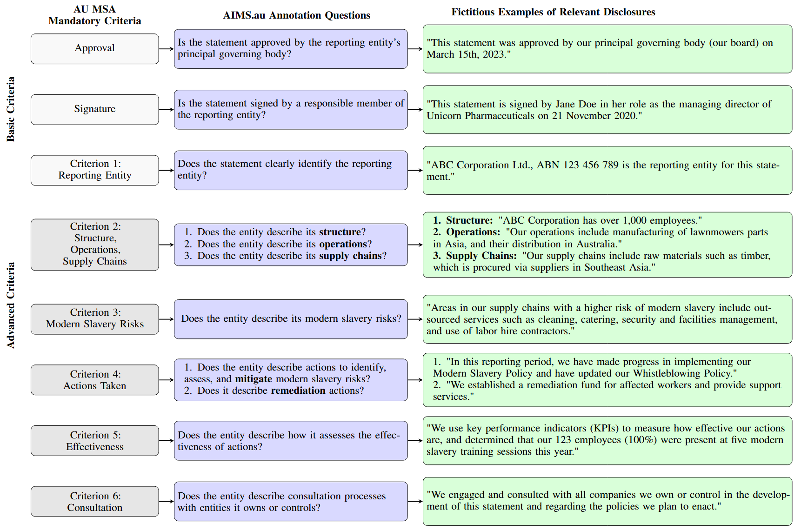

<div align="center">
  
</div>
      
# Project AIMS (AI Against Modern Slavery) - Phase 2

Welcome to the **Project AIMS (AI Against Modern Slavery) Phase 2** repository. This initiative is a collaborative effort between [Mila - Quebec AI Institute](https://mila.quebec/) and [Queensland University of Technology (QUT)](https://www.qut.edu.au/), leveraging artificial intelligence to combat modern slavery through transparency and corporate accountability.

> 📌 **Previous Work**: This builds upon [Project AIMS Phase 1](https://github.com/mila-ai4h/ai4h_aims-uk), which analysed UK-based organisations' statements on modern slavery.

This repository contains:
1. **Two published research papers** and their associated artifacts
2. **AIMS Hackathon 2025** resources and winning solutions

> 💡 For the complete list of publications and project details, visit the [**Project AIMS website**](https://mila.quebec/en/ai4humanity/applied-projects/ai-against-modern-slavery-aims).

---

## 📚 Research Publications

This research was supported by the **National Action Plan to Combat Modern Slavery 2020-25 Grants Program**, administered by the Attorney-General's Department of Australia.

### 🔗 Associated Resources

- 📂 **Dataset**: Available on [Figshare](https://figshare.com/s/1b92ebfde3f2de2be0cf) and [Hugging Face](https://huggingface.co/datasets/mila-ai4h/AIMS.au)
- 💬 **Prompts**: Experimental prompts available in [AIMSPrompts.docx](AIMSPrompts.docx)
- 💻 **Code**: Reproducible experiments in the [`code`](code) directory
- 📦 **Model Weights**:
  - Llama3.2 3B (+100 words context) - Best performing model from AIMS.au and AIMSCheck: [Figshare](https://figshare.com/articles/dataset/LLAMA_context_100_weights/29174045?file=54904154)
  - ModernBERT - Smallest and best performing model from AIMSDistil: [Google Drive](https://drive.google.com/file/d/12DXXgi5rNRf8r8EKnjmzwR6GnNVTc1WI/view?usp=sharing)

---

## 📄 Paper 1: AIMS.au Dataset

**Full Title**: *AIMS.au: A Dataset for the Analysis of Modern Slavery Countermeasures in Corporate Statements*  
**Venue**: ICLR 2025  
**Paper**: [arXiv:2502.07022](https://arxiv.org/abs/2502.07022)  
**License**: CC-BY-4.0
### Overview

**AIMS.au** is the most extensive open-source dataset with detailed annotations explicitly aligned with the mandatory criteria of the Australian Modern Slavery Act (MSA). It supports the analysis of modern slavery statements from Australian-based organisations and enables the evaluation of Large Language Models (LLMs) in assessing corporate compliance.

### Key Features

- **📊 Comprehensive Coverage**: Over **5,700** modern slavery statements from the [Australian Modern Slavery Register](https://modernslaveryregister.gov.au/)
- **🏷️ Detailed Annotations**: Sentence-level labels by human annotators and domain experts
  - Basic criteria (approval, signature, entity identification): single-annotated
  - Complex criteria (requiring nuanced interpretation): double-annotated for 4,657 statements
  - Over **800,000** labeled sentences covering **7,270** Australian entities from **2019 to 2023**
- **⭐ Gold Standard Subsets**: Two expert-annotated subsets with **50** unique statements each for high-reliability evaluations


### Data Structure

The dataset consists of three annotation levels:

1. **Annotated Dataset** – For model training
2. **Gold Subset (single expert validation)** – For model validation
3. **Gold Subset (triple-expert consensus)** – For model testing (highest trust level)


### Dataset Documentation

The following diagram illustrates the correspondence between AU MSA mandatory criteria and the annotation questions in AIMS.au, including fictitious examples:



### Dataset Statistics

Text distribution across 5,731 modern slavery statements:


### Experimental Setup

**Task**: Sentence-level binary classification across 11 questions

**Models Evaluated**:
- **Fine-tuned**: DistilBERT, BERT, Llama2 (7B), Llama3.2 (3B)
- **Zero-shot**: GPT-3.5 Turbo, GPT-4o, Llama3.2 (3B)

**Input Settings**:
- **No context**: Classify using only the target sentence
- **With context**: Classify using sentence ±100 surrounding words

**Key Results**:
- ✅ Fine-tuned models outperform zero-shot models
- ✅ Including context improves classification performance

> 📖 Full experimental details available in the paper

---

## 📄 Paper 2: AIMSCheck Framework

**Full Title**: *AIMSCheck: Leveraging LLMs for AI-Assisted Review of Modern Slavery Statements Across Jurisdictions*  
**Venue**: ACL 2025  
**Paper**: [arXiv:2506.01671](https://arxiv.org/abs/2506.01671)

### Overview

**AIMSCheck** is an end-to-end framework for AI-assisted review of modern slavery statements using Large Language Models. It addresses two critical challenges:

1. The difficulty of compliance verification due to diverse and complex disclosure language
2. The need for generalizable AI tools across jurisdictions with different legal standards

### Key Contributions

1. **AIMSCheck Framework**: End-to-end compliance validation system
2. **New Datasets**: AIMS.uk (United Kingdom) and AIMS.ca (Canada) for cross-jurisdictional benchmarking

### AIMSCheck Architecture


The framework operates at three distinct levels:

1. **Sentence-Level**: Classifies relevance to compliance criteria
2. **Token-Level**: Enhances transparency through explainability metrics
3. **Evidence Status**: Tracks sentences supporting or refuting implementation/commitments

### Cross-Jurisdictional Generalizability

We created a jurisdictional mapping to assess generalizability across regions:


**AIMS.uk and AIMS.ca** datasets each contain 50 manually annotated statements by domain experts, facilitating cross-jurisdictional evaluation.

### Experimental Setup

**Task**: Sentence-level binary classification across 9 compliance criteria + evidence status tracking

**Models Evaluated**:
- **Zero-shot**: GPT-3.5 Turbo, GPT-4o
- **Few-shot**: GPT-4o with Chain-of-Thought (CoT) and examples
- **Reasoning**: DeepSeek-R1
- **Fine-tuned**: DistilBERT, BERT, LLaMA 2 (7B), LLaMA 3.2 (3B)

**Input Settings**: 
- No context (single sentence)
- With context (sentence ±100 words)
- Token-level explanation using SHAP

### Key Results

1. ✅ Fine-tuned models on AIMS.au generalise well to AIMS.uk and AIMS.ca, outperforming zero-shot and few-shot baselines
2. ✅ Chain-of-Thought few-shot prompting improves GPT-4o performance
3. ✅ Contextual input (±100 words) improves performance across all models

---

## 📖 Citation

If you use AIMS.au or AIMSCheck in your research, please cite our papers:
```bibtex
@article{bora2025aimsau,
  title={AIMS.au: A Dataset for the Analysis of Modern Slavery Countermeasures in Corporate Statements},
  author={Bora, Adriana Eufrosina and St-Charles, Pierre-Luc and Bronzi, Mirko and Fansi Tchango, Arsène and Rousseau, Bruno and Mengersen, Kerrie},
  journal={arXiv preprint arXiv:2502.07022},
  year={2025},
  note={Camera ready. ICLR 2025},
  url={https://arxiv.org/abs/2502.07022},
  doi={10.48550/arXiv.2502.07022}
}

@article{bora2025aimscheck,
  title={AIMSCheck: Leveraging LLMs for AI-Assisted Review of Modern Slavery Statements Across Jurisdictions},
  author={Bora, Adriana Eufrosina and Arodi, Akshatha and Zhang, Duoyi and Bannister, Jordan and Bronzi, Mirko and Fansi Tchango, Arsène and Bashar, Md Abul and Nayak, Richi and Mengersen, Kerrie},
  journal={arXiv preprint arXiv:2506.01671},
  year={2025},
  note={To appear at ACL 2025},
  url={https://arxiv.org/abs/2506.01671},
  doi={10.48550/arXiv.2506.01671}
}
```

---

## 🤝 AIMS Hackathon 2025

### AI Against Modern Slavery Innovation Challenge

[The AIMS Hackathon 2025](https://fundacionpasoslibres.org/aimshackathon/) was a global online innovation competition organised by [Mila - Quebec AI Institute](https://mila.quebec/), [Queensland University of Technology (QUT)](https://www.qut.edu.au/) and [Fundacion Pasos Libres](https://fundacionpasoslibres.org/) that brought together developers, entrepreneurs, researchers, and human rights advocates to develop AI-driven solutions to combat modern slavery. 

**Hackathon Goals:**
- 🌍 Raise public awareness of modern slavery
- 🎓 Improve participants' technical and domain expertise
- 🤝 Foster interdisciplinary collaboration
- 🚀 Accelerate adoption of open-source Project AIMS tools

**Participation:** The hackathon brought together over **50 speakers and judges** and more than **50 teams**, totaling **220+ registered participants** from **19 countries**, with **23 teams** advancing to the final judging stage.

---

### 🏆 Winners & Award Recipients

#### 🥇 **WINNER & Best in Blue Sky Innovation (Challenge 4): Commit Hope**
- **Repository**: [AIMS-Commit-Hope](https://github.com/fpasoslibres/AIMS-Commit-Hope) - TypeScript
- **Website**: [commithope.org](https://www.commithope.org/aimshackathon/compliance)
- **Resources**:
  - [Presentation Video](https://www.youtube.com/watch?v=saguXuoUhcE)
  - [Demo Video](https://www.youtube.com/watch?v=31C5L0IUP1Y)

#### 🥈 **Team Synapse** — Best in Data Mining, Processing & Enhancement (Challenge 1)
- **Repository**: [AIMS-Team-Synapse](https://github.com/fpasoslibres/AIMS-Team-Synapse) - Jupyter Notebook
- **Resources**:
  - [Presentation Video](https://www.youtube.com/watch?v=_OubzlX-qhA)
  - [Demo Video](https://drive.google.com/drive/folders/16kIWEin_ucPzA9cHODtQjf-jtXjdOhK8)

#### 🥈 **The Due Diligents** — Best in AI Model Optimisation & Explainability (Challenge 2)
- **Repository**: [AIMS-the-due-diligents](https://github.com/fpasoslibres/AIMS-the-due-diligents) - Python
- **Resources**:
  - [Presentation Video](https://drive.google.com/file/d/1mhfHqO1HWl3FutQ3imVKwjz4qfB99yPj/view?usp=drive_link)
  - [Demo Video](https://vimeo.com/1120437663?share=copy)

#### 🥈 **Firefly** — Best in Application & Visualisation for Stakeholder Use (Challenge 3)
- **Repository**: [AIMS-Firefly](https://github.com/fpasoslibres/AIMS-Firefly) - C#
- **Resources**:
  - [Presentation Video](https://drive.google.com/file/d/1AyDuQPehxk0eya7Y9stKRThsVkZuEbzB/view?usp=drive_link)
  - [Demo Video](https://drive.google.com/file/d/1-CqB5CkJvI7OvmJRQ0cASjpPQIbuW0Ng/view?usp=drive_link)

### ⭐ Special Recognition Awards

The following teams received Special Recognition at the AIMS Hackathon 2025 for excellence in specific areas:

- **⭐ BigMilk** — [AIMS-Big-Milk](https://github.com/fpasoslibres/AIMS-Big-Milk) - Strong Consumer-Focused Innovation
- **⭐ Justice Miners** — [AIMS-Justice-Miners](https://github.com/fpasoslibres/AIMS-Justice-Miners) - Strong Code Documentation Practices
- **⭐ TSU Montreal** — [AIMS-TSU-Montreal](https://github.com/fpasoslibres/AIMS-TSU-Montreal) - Strong Focus on Explainability and Modularity
- **⭐ ChainBreaker** — [AIMS-ChainBreaker](https://github.com/fpasoslibres/AIMS-ChainBreaker) - Strong User Interface Design
- **⭐ PolyML** — [AIMS-PolyML](https://github.com/fpasoslibres/AIMS-PolyML) - Innovative Approach to News Article Integration
---

### 📂 All Finalist Teams

All 23 finalist solutions selected for the judging stage:

1. [AIMS-TSU-Montreal](https://github.com/fpasoslibres/AIMS-TSU-Montreal)⭐ 
2. [AIMS-AIbolition](https://github.com/fpasoslibres/AIMS-AIbolition) 
3. [AIMS-PolyML](https://github.com/fpasoslibres/AIMS-PolyML)⭐ 
4. [AIMS-Gongpals](https://github.com/fpasoslibres/AIMS-Gongpals)
5. [AIMS-Data-Phandas-](https://github.com/fpasoslibres/AIMS-Data-Phandas-) 
6. [AIMS-Meow](https://github.com/fpasoslibres/AIMS-Meow) 
7. [AIMS-ChainBreaker](https://github.com/fpasoslibres/AIMS-ChainBreaker)⭐ 
8. [AIMS-Code4Freedom-AUS](https://github.com/fpasoslibres/AIMS-Code4Freedom-AUS) 
9. [AIMS-Big-Milk](https://github.com/fpasoslibres/AIMS-Big-Milk)⭐ 
10. [AIMS-Quokkas](https://github.com/fpasoslibres/AIMS-Quokkas) 
11. [AIMS-Team-Synapse](https://github.com/fpasoslibres/AIMS-Team-Synapse)🥈
12. [AIMS-New-Horizons-Foundation](https://github.com/fpasoslibres/AIMS-New-Horizons-Foundation) 
13. [AIMS-Winning-Team-](https://github.com/fpasoslibres/AIMS-Winning-Team-) 
14. [AIMS-AI-Against-Chains](https://github.com/fpasoslibres/AIMS-AI-Against-Chains) 
15. [AIMS-the-due-diligents](https://github.com/fpasoslibres/AIMS-the-due-diligents)🥈
16. [AIMS-Justice-Miners](https://github.com/fpasoslibres/AIMS-Justice-Miners)⭐ 
17. [AIMS-Firefly](https://github.com/fpasoslibres/AIMS-Firefly)🥈
18. [AIMS-Commit-Hope](https://github.com/fpasoslibres/AIMS-Commit-Hope)🥇
19. [AIMS-out-slavery-solution](https://github.com/fpasoslibres/AIMS-out-slavery-solution) 
20. [AIMS-Code4Freedom-CA](https://github.com/fpasoslibres/AIMS-Code4Freedom-CA) 
21. [AIMS-50M](https://github.com/fpasoslibres/AIMS-50M) 
22. [AIMS-The-Aula-Team](https://github.com/fpasoslibres/AIMS-The-Aula-Team) 
23. [AIMS-Code-knights](https://github.com/fpasoslibres/AIMS-Code-knights) 

[View all hackathon repositories →](https://github.com/fpasoslibres?tab=repositories)

---

## 🌟 Impact

This hackathon brought together multidisciplinary teams from around the world to:
- 🔍 Raise awareness of modern slavery and human trafficking
- 💻 Develop innovative AI-driven solutions for compliance analysis
- 🤝 Foster collaboration between technologists and human rights advocates
- 🚀 Advance open-source tools for corporate transparency and accountability

---

## 📄 License

This repository is licensed under the **Creative Commons Attribution 4.0 International License (CC-BY-4.0)**, unless otherwise stated.

Unless otherwise stated, this licence applies to the entire GitHub repository, including all files, folders, subdirectories, documentation, research artefacts, datasets, and released model weights contained in this repository.

Users are responsible for complying with any additional terms that apply to upstream models, third-party datasets, dependencies, externally hosted files, or linked resources.

### Recommended attribution

When using, redistributing, or adapting material from this repository, please use the following attribution:

> Project AIMS (AI Against Modern Slavery) by Mila - Quebec AI Institute and Queensland University of Technology (QUT), licensed under CC-BY-4.0. Available at: https://github.com/mila-studios/ai4h_aims-au

Please also cite the relevant paper listed in the [Citation](#-citation) section when using AIMS.au, AIMSCheck, AIMSDistil, or associated research artefacts.

## 📞 Contact

For questions or collaboration opportunities, please visit:
- [Project AIMS Website](https://mila.quebec/en/ai4humanity/applied-projects/ai-against-modern-slavery-aims)


